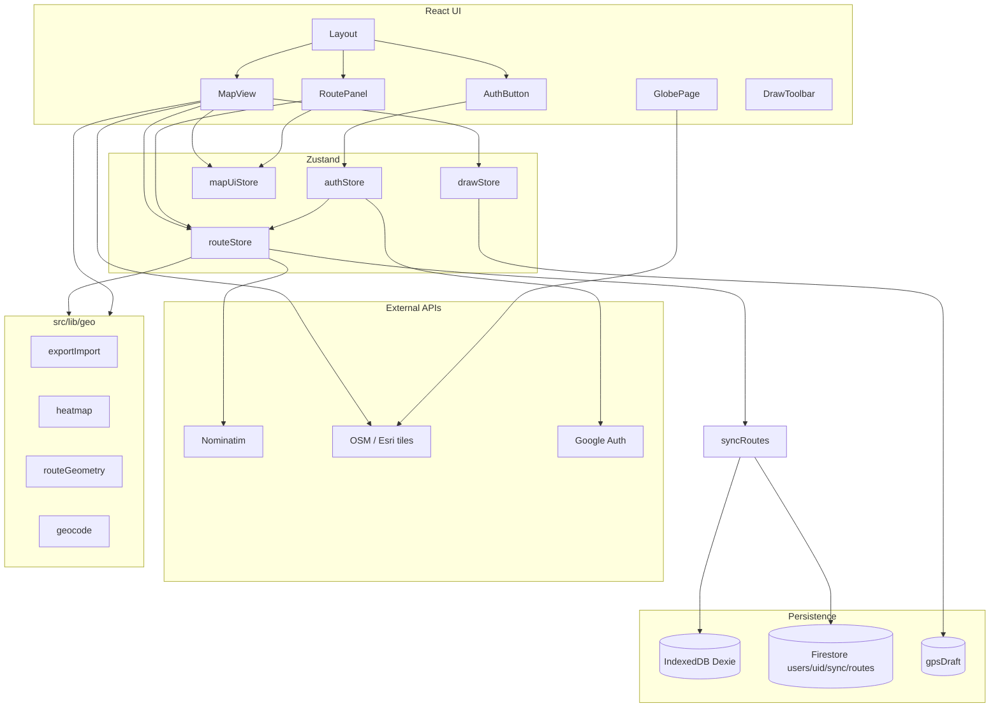

# Архитектура

## Диаграмма высокого уровня



`syncRoutes` — `src/lib/firebase/syncRoutes.ts`. Без Firebase Firestore-ветка не используется.

## Структура каталогов

```
your-path-tracker/
├── docs/                    # Документация (этот каталог)
├── plans/                   # Roadmap (p0–p3), не runtime
├── public/                  # Статика: favicon, manifest, icons
├── scripts/                 # утилиты (authorized domains и т.п.)
├── src/
│   ├── App.tsx              # BrowserRouter, authStore.init
│   ├── main.tsx
│   ├── index.css
│   ├── components/
│   │   └── Layout.tsx
│   ├── pages/
│   │   ├── MapPage.tsx
│   │   └── GlobePage.tsx
│   ├── features/
│   │   ├── auth/            # AuthButton
│   │   ├── map/
│   │   ├── draw/
│   │   └── routes/
│   ├── stores/
│   │   ├── routeStore.ts
│   │   ├── drawStore.ts
│   │   ├── authStore.ts
│   │   └── mapUiStore.ts
│   ├── db/
│   │   ├── routesDb.ts      # Dexie
│   │   └── routesFirestore.ts
│   ├── types/
│   │   └── route.ts
│   └── lib/
│       ├── firebase/        # config, auth, sync, sanitize
│       ├── geo/
│       └── map/
│           └── setupMapLibre.ts
├── Makefile
├── .yarnrc.yml
├── firebase.json
├── firestore.rules
├── index.html
├── vite.config.ts
├── package.json
└── tsconfig*.json
```

## Паттерны

### Feature-based folders

Код группируется по фичам (`features/map`, `features/draw`, `features/routes`, `features/auth`). Общая логика — в `lib/`.

### Map layers через imperative MapLibre API

React-компонент `Map` из react-map-gl рендерит контейнер; слои маршрутов, heatmap, preview и «моя локация» добавляются **имperatively** через `map.addSource` / `map.addLayer`.

### Источники правды для маршрутов

| Контекст | Источник |
|----------|----------|
| Гость / Firebase выключен | IndexedDB `routes` |
| Залогинен, cloud непустой | Firestore документ sync; Dexie = кэш |
| Preview рисования | `drawStore.points` (ещё не сохранено) |
| GPS draft | IndexedDB `gpsDraft` (не в cloud) |

Сохранение: `RouteFeature` → `routeStore.addRoute` / `updateRoute` → `persistRoute` → Dexie и при uid ещё Firestore.

### GeoJSON как модель данных

Маршрут = `Feature<LineString, RouteProperties>`. ID в `properties.id` — ключ Dexie и `promoteId` в MapLibre. В Firestore тот же массив сериализуется в `routesJson`.

## Роутинг

```tsx
// App.tsx
<Routes>
  <Route element={<Layout />}>
    <Route index element={<MapPage />} />
    <Route path="globe" element={<GlobePage />} />
    <Route path="*" element={<Navigate to="/" replace />} />
  </Route>
</Routes>
```

`Layout` показывает `DrawToolbar`, `GpsResumePrompt`, `RoutePanel` только на `/`. `AuthButton` — на всех страницах.

## Инициализация приложения

1. `main.tsx` — `setupMapLibre` (worker URL `/maplibre/...`), CSS, React root
2. `App.tsx` — `authStore.init()`
3. Firebase выключен → `routeStore.loadRoutes()` из Dexie
4. Firebase включён → `onAuthStateChanged` → sync или `loadRoutes`
5. `loadRoutes` — `loadRoutesForCurrentUser` → thinRoutes → backfill дат → persist changes → sort → deferred geocoding

## Зависимости между модулями

| Модуль | Зависит от | Не должен зависеть от |
|--------|------------|------------------------|
| `lib/geo/*` | turf, types | React, stores, firebase |
| `lib/firebase/*` | firebase SDK, db, types | React components |
| `stores/*` | db, lib/geo, lib/firebase | React components |
| `features/*` | stores, lib | другие features (минимально) |
| `useMapLayers` | lib/geo, routeStore (read) | drawStore |

При добавлении функциональности: **lib → store → feature component**. Persistence маршрутов — через `syncRoutes`, не прямой вызов Dexie из UI.
