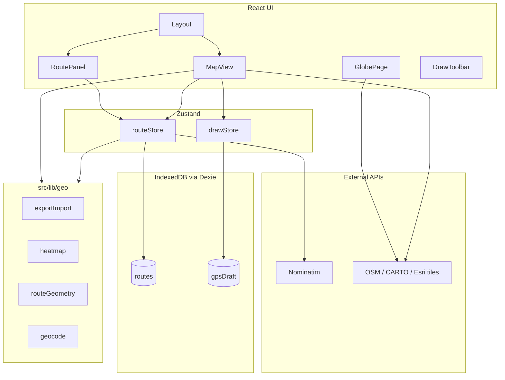

# Архитектура

## Диаграмма высокого уровня



## Структура каталогов

```
your-path-tracker/
├── docs/                    # Документация (этот каталог)
├── public/                  # Статика: favicon, manifest, icons
├── src/
│   ├── App.tsx              # BrowserRouter, loadRoutes on mount
│   ├── main.tsx
│   ├── index.css            # Все стили приложения (CSS classes)
│   ├── components/
│   │   └── Layout.tsx       # Shell: header, nav, RoutePanel, Outlet
│   ├── pages/
│   │   ├── MapPage.tsx      # Thin wrapper → MapView
│   │   └── GlobePage.tsx    # Globe map + place overlay
│   ├── features/
│   │   ├── map/             # Карта, слои, controls, search
│   │   ├── draw/            # Hooks: freehand, GPS, vertex edit
│   │   └── routes/          # RoutePanel, RouteItem, StatsPanel
│   ├── stores/
│   │   ├── routeStore.ts    # CRUD маршрутов, import, heatmap, map style
│   │   └── drawStore.ts     # Режим рисования, GPS session
│   ├── db/
│   │   └── routesDb.ts      # Dexie schema
│   ├── types/
│   │   └── route.ts         # RouteFeature, helpers
│   └── lib/
│       ├── geo/             # Чистые функции геоданных
│       └── map/
│           └── setupMapLibre.ts  # Worker URL для MapLibre
├── index.html
├── vite.config.ts
├── package.json
└── tsconfig*.json
```

## Паттерны

### Feature-based folders

Код группируется по фичам (`features/map`, `features/draw`, `features/routes`), а не по типу файла. Общая логика — в `lib/`.

### Map layers через imperative MapLibre API

React-компонент `Map` из react-map-gl рендерит контейнер; слои маршрутов, heatmap и preview добавляются **имperatively** в хуках `useMapLayers.ts` через `map.addSource` / `map.addLayer`. Это сознательный выбор для производительности при частых обновлениях GeoJSON.

### Единый источник правды для маршрутов

- **Persisted**: IndexedDB (`routes` table)
- **Runtime**: `routeStore.routes`
- **Draw preview**: `drawStore.points` (ещё не сохранено)

При сохранении draw → `RouteFeature` → `addRoute` → Dexie → обновление store.

### GeoJSON как модель данных

Маршрут = `Feature<LineString, RouteProperties>`. ID хранится в `properties.id` и используется как primary key в Dexie и `promoteId` в MapLibre source.

## Роутинг

```tsx
// App.tsx
<Routes>
  <Route element={<Layout />}>
    <Route index element={<MapPage />} />
    <Route path="globe" element={<GlobePage />} />
    <Route path="*" element={<Navigate to="/" replace />} />
  </Route>
</Routes>
```

`Layout` показывает `RoutePanel`, `DrawToolbar`, `GpsResumePrompt` только на `/` (map page).

## Инициализация приложения

1. `main.tsx` — `setupMapLibre` (worker), CSS, React root
2. `App.tsx` — `useEffect` → `routeStore.loadRoutes()`
3. `loadRoutes` — читает IndexedDB, thinRoutes, backfill дат, sort, deferred geocoding

## Зависимости между модулями

| Модуль | Зависит от | Не должен зависеть от |
|--------|------------|------------------------|
| `lib/geo/*` | turf, types | React, stores |
| `stores/*` | db, lib/geo | React components |
| `features/*` | stores, lib | другие features (минимально) |
| `useMapLayers` | lib/geo, routeStore (read) | drawStore |

При добавлении функциональности предпочитайте: **lib → store → feature component**.
